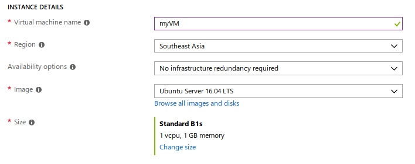

# azure101
Reference material for Introduction to Cloud Computing using Microsoft Azure.

This document contains two parts:
- [Host a static website using Azure storage](#host-a-static-website-using-azure-storage)
- [Create a Linux Virtual Machine using Azure Portal](#create-a-linux-virtual-machine-using-azure-portal)

---

## Host a static website using Azure storage
1. If you don't have an Azure subscription, create a [free account](https://azure.microsoft.com/en-us/free/) before you begin.  

    **Note**: If you are a student, you can get $100 of credit to get started and sign up without a credit card [here](https://azure.microsoft.com/en-us/free/students/) by providing your school email address.

2.  [Create a GPv2 storage account](https://docs.microsoft.com/en-us/azure/storage/common/storage-quickstart-create-account?tabs=portal)

3. Using the Azure Portal, click on "Static website (preview)" under "Settings" in the left navigation bar.


4. Click "Enabled" and enter the name of the index document and (optionally) the custom error document path.

5. Upload your web assets to the "$web" container that was created as a part of static website enablement.

6. Make sure to include an index document with the name you configured. In this example, the document's name is "index.html".

    **Note**: The document name is case sensitive and therefore needs to match the name of the file in storage exactly.

7. Finally, navigate to your web endpoint to test your website.

[Reference](https://docs.microsoft.com/en-us/azure/storage/blobs/storage-blob-static-website)

---

## Create a Linux Virtual Machine using Azure Portal

1. Create SSH key pair:
**Note**: If you have an existing SSH key pair, this step can be skipped.

    To create an SSH key pair and log into Linux VMs, run the following command from a Bash shell and follow the on-screen directions.

    ```sh
    ssh-keygen -t rsa -b 2048
    ```
    Copy the contents of the generated public key file (\<filename>.pub) to the clipboard.

2. Log in to the [Azure portal](http://portal.azure.com).

3. Create virtual machine:
    - Create a resource
    - Ubuntu Server 16.04 LTS
    - Create

4. Under **Basics** tab, select appropriate Subscription and Resource group.


5. Under **Instance Details**, type *myVM* for the Virtual machine name and choose Southeast Asia for your **Region**. Leave the other defaults. 
You can use **Change size** to change the hardware configuration for your VM.


6. Under **Administrator Account**, select **SSH public key**, type your user name, then paste the public key you copied earlier into the text box. Remove any leading or trailing white space in your public key.


7. Under **Inbound port rules** > **Public inbound ports**, choose **Allow selected ports** and then select **SSH (22)** and **HTTP (80)** from the drop-down.


8. Leave the remaining defaults and then select the **Review + create** button at the bottom of the page.

9. Connect to virtual machine by creating an SSH connection with the VM:

    Select the Connect button on the overview page for your VM. 
    
    In the **Connect to virtual machine** page, keep the default options to connect by DNS name over port 22. In **Login using VM local account** a connection command is shown. Click the button to copy the command. The following example shows what the SSH connection command looks like:
    ```sh
    ssh azureuser@myvm-123abc.eastus.cloudapp.azure.com

    ```
    Paste the SSH connection command into a shell, such as Bash on Ubuntu to create the connection. 